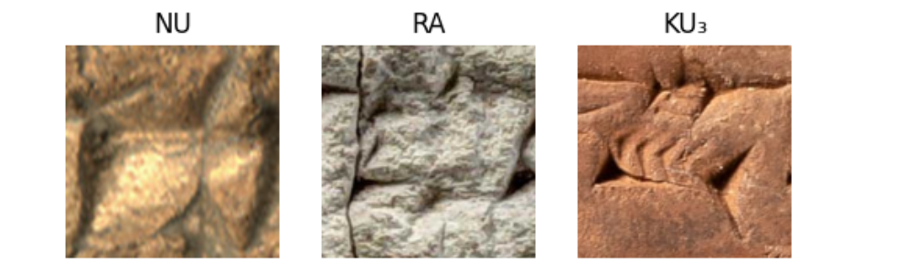

## Sumerian Sign Classification

This project focuses on classifying cuneiform signs from cropped image snippets.
The long-term goal is to support downstream tasks such as automatic transliteration/translation pipelines.

Example image samples:



## Dataset

The dataset is described in this [article](https://openhumanitiesdata.metajnl.com/articles/10.5334/johd.503) and hosted on [Zenodo](https://zenodo.org/records/17949595).

Download annotations and images:

```bash
# annotations (JSON)
wget "https://zenodo.org/records/17949595/files/signs_snippets_metadata.json?download=1" --continue

# image archive (TAR.GZ)
wget "https://zenodo.org/records/17949595/files/signs_snippets_archive.tar.gz?download=1" --continue
```

Then unpack images:

```bash
tar -xzf signs_snippets_archive.tar.gz
```

## Project Scope and Result

This repository benchmarks deep learning models on the **top-50 most frequent sign classes**.
The reported best result is **0.927 accuracy**.

Supported model families:

- [ResNet](https://arxiv.org/abs/1512.03385)
- [EfficientNet](https://arxiv.org/abs/1905.11946)
- [ConvNeXT](https://arxiv.org/abs/2201.03545)
- [ViT](https://arxiv.org/abs/2010.11929)
- [Swin Transformer](https://arxiv.org/abs/2103.14030)

## Installation

The project uses [uv](https://docs.astral.sh/uv/) for dependency management.

```bash
uv sync
```

Python version: `>=3.12, <3.14`.

## Quick Start

### 1) Prepare train/val/test splits

```bash
uv run dataset/prepare_dataset.py \
  --input signs_snippets_metadata.json \
  --output dataset/splits
```

This command creates:

- `dataset/splits/train.csv`
- `dataset/splits/val.csv`
- `dataset/splits/test.csv`

### 2) Train a model

```bash
uv run train.py --config configs/vit_b_16.yaml
```

You can use other configs from `configs/` (for example, `swin_t.yaml`).

### 3) Evaluate a trained model

```bash
uv run evaluate.py --config configs/vit_b_16.yaml
```

### 4) Run Gradio demo app

Run the web demo for single-image inference:

```bash
uv run demo_app.py \
  --configs configs/vit_b_16.yaml \
  --ckpt-path outputs/vit_b_16/checkpoints/last.ckpt
```

You can also use `--config` instead of `--configs`.

Optional server arguments:

- `--server-name` (default: `127.0.0.1`)
- `--server-port` (default: `7860`)

Example with a custom port:

```bash
uv run demo_app.py \
  --config configs/convnext_base_224.yaml \
  --ckpt-path outputs/convnext_base_224/checkpoints/last.ckpt \
  --server-port 7861
```

## Configuration

Each YAML config defines:

- `model_name` (for example: `resnet50`, `efficientnet_b0`, `vit_b_16`, `swin_t`, or `convnext:facebook/convnext-tiny-224`)
- paths to split CSV files (`train_path`, `val_path`, `test_path`)
- `image_folder`
- training hyperparameters (`batch_size`, `learning_rate`, `num_epochs`)
- `output_folder` for checkpoints and logs

## Outputs

After training, artifacts are saved under `output_folder`:

- `checkpoints/` with the best and last checkpoints
- `logs/` with Lightning CSV logs
- `best_checkpoint.txt` with the best checkpoint path
